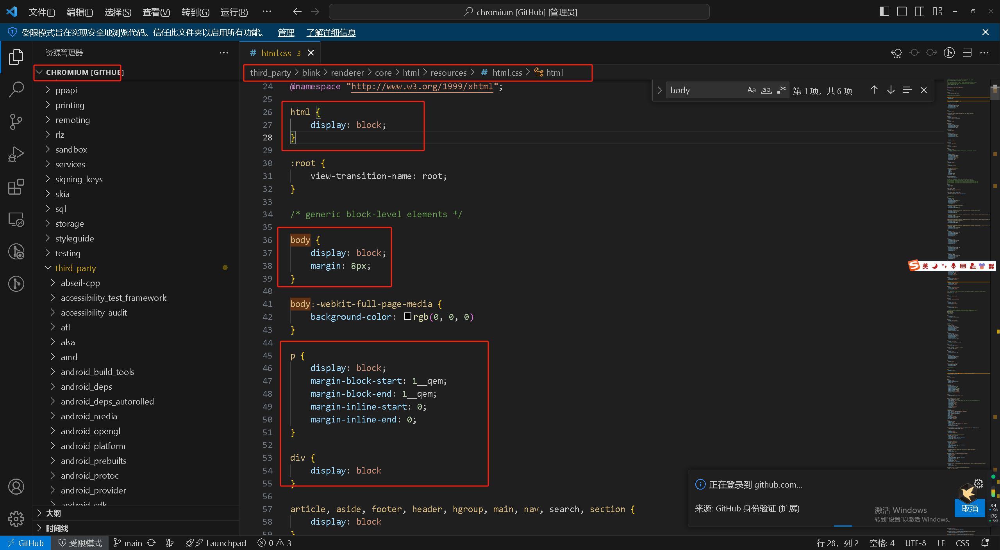

## 大师课

## 如何理解JS中的异步?

参考答案:
JS是一门单线程的语言,这是因为它运行再浏览器渲染的主线程中,而渲染线程只有一个.
而渲染主线程承担很多工作,渲染页面,执行js都在其中.
如果使用同步的方式,那么渲染主线程极有可能会导致阻塞,从而导致执行消息队列中很多其他任务无法执行.
这样一来,一方面会导致繁忙的主线程白白的消耗时间,另一方面导致无法及时更新,给用户造成页面卡死的现象.
所以浏览器采用异步的方式来避免.具体做法是当某些任务发生时,比如,计时器,网络,事件监听,主线程将任务交给其他线程去处理,自身立即结束任务的执行,
转而执行后续代码.当其他线程完成时,将事先传递的回调函数包装成任务,加入到消息队列的末尾排队,等待主线程调度执行.
在这种异步模式下,浏览器将永不阻塞,从而最大限度的保证了单线程的流畅运行

## 阐述一下js的事件循环

