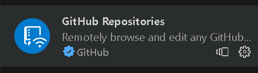

## 大师课

## 浏览器如何渲染页面的

1.先拿到html文档,然后解析html文档拿到Dom树以及Css树
Dom树:浏览器打印document console.log(document)或者console.dir(document)

chrom浏览器css默认样式源代码

github地址:https://github.com/chromium/chromium
源代码太大,不建议下载,可以用插件预览

2.样式计算
3.布局 layout
4.分层
5.绘制
6.分块
7.光珊化
8.画
